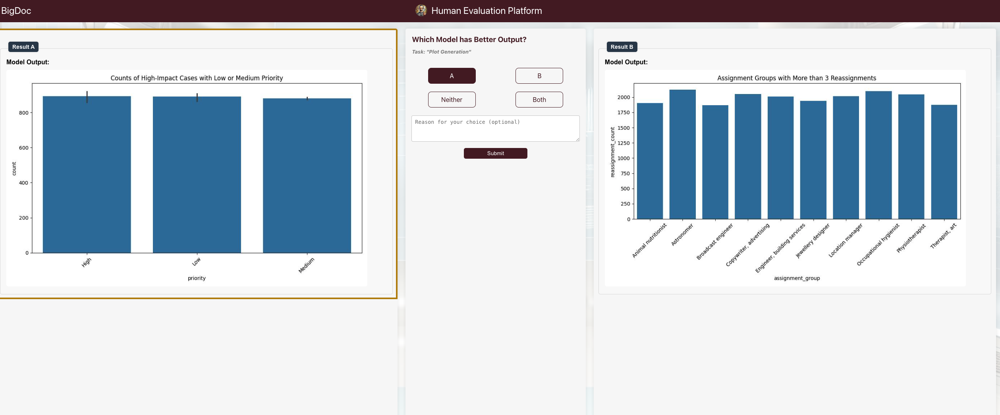

## Overview

This is a human evaluation platform called **JudgeOsiris**, named after the "judge of the dead" of ancient Egypt.

## Quick Start

### 1. Run Web App

```
python app.py -m1 <path to model 1 predictions> 
              -m2 <path to model 2 predictions> 
              -o <folder where results are saved>
              -t <name of the task>
              -p <port number>
```

**Caveat:** `m1` and `m2` are paths that should be under "static"


### 2. Click on generated url to get an image like the one below

Choose which output you prefer from the models




### 3. Customize the App for your Task

1. **Output Card**: Change this file to include the things you want to be displayed
        `templates/fragments/output_card.html`

2. **Load the Predictions**: Change this function in `app.py` to load the `pred_list` where each item in the list is rendered onto the `output_card` as a dict

### 4. Host the App with a public link

```
ngrok http <port_number>
```